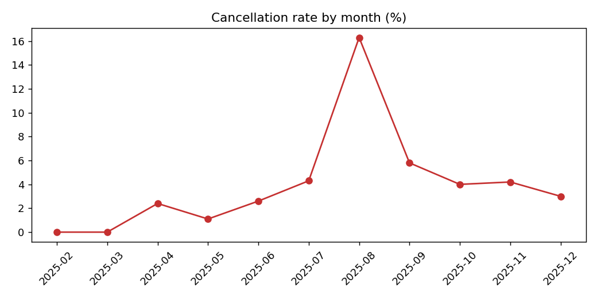

# Fulfillment Radar

SQL and Python analytics for a B2B food-supply marketplace: monthly revenue, order value, cancellations, seller delivery performance, and repeat-buyer behavior.

**The data is synthetic.** I generated it with a script (`src/generate_data.py`) and built a few patterns in on purpose, so the analysis has something to find. Nothing comes from a real company. The project shows the method: define KPIs in SQL, check them with tests, and turn the numbers into recommendations.

## What it answers

| Question | Where |
|---|---|
| How are GMV, orders, and average order value trending? | `sql/kpis.sql` (monthly_kpis) |
| When did cancellations spike? | cancellation_rate_by_month |
| Which sellers deliver late? | seller_on_time |
| Do repeat buyers matter more than one-time buyers? | repeat_vs_one_time |
| Which categories earn the most? | category_performance |

Results are written to `reports/` as CSV files, three charts, and a short written summary in [`reports/FINDINGS.md`](reports/FINDINGS.md).



## Run it

```bash
pip install -r requirements.txt
python src/generate_data.py      # writes data/*.csv (seeded, so the output is repeatable)
python -m src.analyze            # loads SQLite, runs the SQL, writes reports/
python -m pytest -v              # 7 tests
```

## Tests

The tests check that the data is deterministic, that there are no orphan foreign keys, that order ids are unique, that GMV from the SQL matches the raw CSV, and that the built-in patterns (the August cancellation spike, the late seller, repeat buyers spending more) are found.

## Definitions

- **GMV / AOV** exclude cancelled orders.
- **On-time** means delivered within the promised number of days.
- **Repeat buyer** means two or more non-cancelled orders.

## Notes

- Built with AI assistance (Claude). I ran the project and can explain the queries and the findings.
- Stack: Python, pandas, SQLite, SQL, matplotlib, pytest, GitHub Actions.
